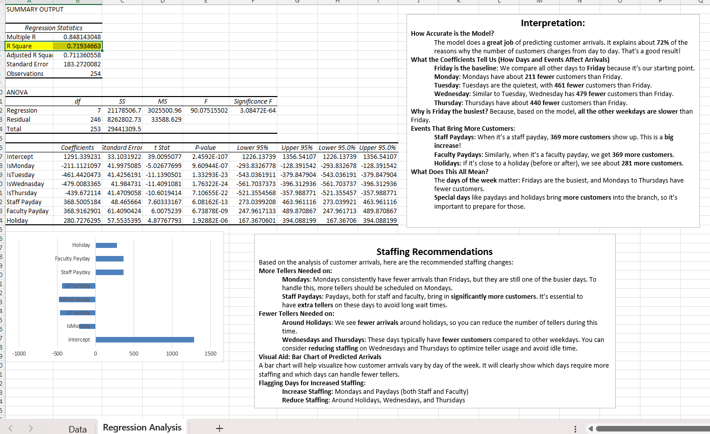
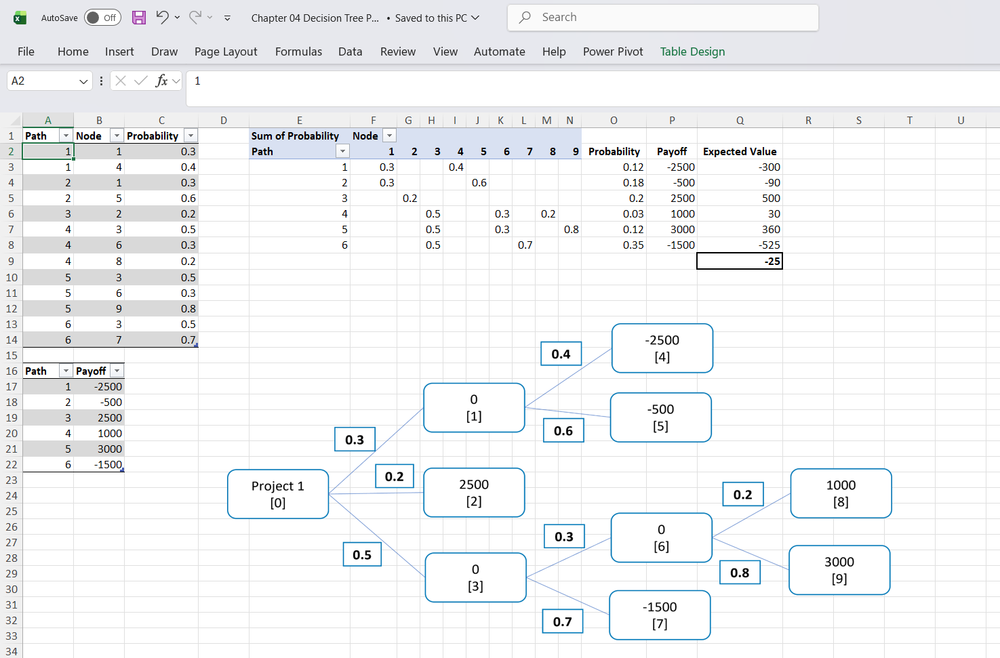

# Customer Arrival Forecasting & Decision Analysis

Multiple linear regression and decision tree analysis predicting daily customer arrivals, built to replace gut-feeling staffing decisions with a data-backed model.

Branch managers often staff by instinct, adding tellers on days that feel busy and cutting back on days that don't. This project tests whether day-of-week patterns and calendar events can actually predict arrival volume well enough to plan staffing around, instead of just reacting to it.

## At a Glance

| | |
|---|---|
| Model type | Multiple linear regression + decision tree |
| Observations | 254 days |
| Accuracy (R²) | 0.719, explains 72% of arrival variance |
| Statistical significance | 3.08E-64 (highly significant) |
| Key output | Day-by-day and event-based staffing recommendations |

## Regression Analysis Preview

## The Model

| Statistic | Value |
|---|---|
| Multiple R | 0.848 |
| R Square | 0.719 (72% variance explained) |
| Adjusted R Square | 0.711 |
| F-statistic | 90.07 |
| Significance F | 3.08E-64 |
| Observations | 254 |

An R² of 0.72 is strong for a staffing forecast. The model captures most of what actually drives daily traffic swings, not just noise.

## Day-of-Week Effects

Compared to Friday, the busiest day of the week:

| Day | Customers vs. Friday |
|---|---|
| Monday | 211 fewer |
| Tuesday | 461 fewer |
| Wednesday | 479 fewer (quietest day) |
| Thursday | 440 fewer |
| Friday | Baseline (highest activity) |

## Calendar Events That Move the Needle

| Event | Impact |
|---|---|
| Staff paydays | +369 customers |
| Faculty paydays | +369 customers |
| Nearby holidays | +281 customers |

Paydays alone move volume more than any single day-of-week effect. It's a pattern easy to miss without regression, and easy to plan around once it's quantified.

## Decision Tree: Is an Extra Teller Worth It?

Beyond forecasting volume, the second half of this project asks a sharper question. On a given day, does adding a teller actually pay off? I built a decision tree weighing payoff outcomes from -$2,500 to +$3,000 across probability-weighted branches.

The result came out to an expected value of -$25, close enough to break-even that the staffing call is genuinely marginal, not obvious either way. That's a more useful answer than a flat yes or no. It tells a manager this decision needs context, like which day or which event, rather than a blanket policy.

## Staffing Recommendations

Add tellers on:
- Mondays, which run busier than they look at first glance
- Staff paydays, with a 369 customer surge
- Faculty paydays, with the same surge pattern

Cut back on:
- Days around holidays, when arrivals noticeably drop
- Wednesdays and Thursdays, consistently the slowest days
- Reducing idle teller time on these days without hurting service

## Tools & Technologies

Microsoft Excel, multiple linear regression, ANOVA, decision tree modeling, expected value analysis, statistical forecasting

## Author

Pratima Kandel
MS in Business Analytics, Webster University
St. Louis, MO
Open to Business Analyst & Data Analyst roles

If you found this project helpful, feel free to star the repo.
